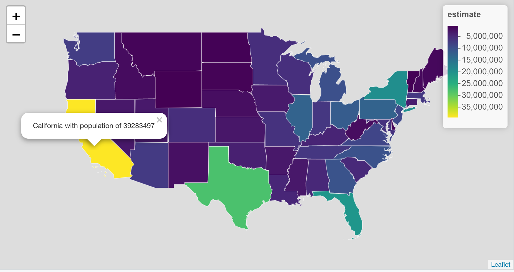

```{r setup, include=FALSE}
knitr::opts_chunk$set(echo = TRUE, warning = FALSE, message = FALSE)
library(sf)
library(tidycensus)
library(janitor)
library(hrbrthemes)
library(here)
library(patchwork)
library(tidyverse)

us_state_pop <- get_acs(
  geography = "state", 
  year = 2019,
  variables = c("population" = "B01001_001"), 
  geometry = TRUE)

us_contiguous_pop <- us_state_pop %>% 
  filter(!NAME %in% c("Alaska", "Hawaii", "Rhode Island", "Puerto Rico")) 

us_contiguous_sf <- us_contiguous_pop %>% 
  select(NAME)

```

We're often asked by clients to make maps, and 9 out of 10 times they ask us to make heat maps. They're more technically called choropleth, but heat maps are incredibly useful and easy to understand maps.

<!--- I thought we should show some maps from consulting projects? if not we could use these !--->
<!-- # ```{r} -->
<!-- # gg_fancy_us_pop <- us_contiguous_pop %>% -->
<!-- #   ggplot() + -->
<!-- #   geom_sf(aes(fill = estimate)) + -->
<!-- #   scale_fill_viridis_c(labels = scales::number_format(scale = 1E-6, big.mark = ",", suffix = " Million"), -->
<!-- #                        name = NULL) + -->
<!-- #   labs(title = "State-level population of the contiguous United States", -->
<!-- #        subtitle = "Source: ACS Survey 2019") + -->
<!-- #   theme_void() %+% -->
<!-- #   theme_ipsum() + -->
<!-- #   theme(legend.position = "top", -->
<!-- #         legend.key.width = unit(3, "cm"), -->
<!-- #         panel.grid.major = element_blank(), -->
<!-- #         axis.text.x = element_blank(), -->
<!-- #         axis.text.y = element_blank()) -->
<!-- # -->
<!-- # order_most_popular_service <- most_popular_streaming_service %>% -->
<!-- #   count(streaming_service, sort = TRUE) %>% -->
<!-- #   pull(streaming_service) -->
<!-- # -->
<!-- # colors_services <- list( -->
<!-- #   "Amazon Prime" = "#2A96D9", -->
<!-- #   "ESPN" = "#BE0002", -->
<!-- #   "Hulu" = "#35B12E", -->
<!-- #   "Netflix" = "black" -->
<!-- # ) -->
<!-- # -->
<!-- # colors_services <- colors_services[order_most_popular_service] -->
<!-- # -->
<!-- # gg_fancy_us_streaming <- us_most_popular_streaming_sf %>% -->
<!-- #   filter(!is.na(streaming_service)) %>% -->
<!-- #   mutate(streaming_service = fct_relevel(streaming_service, order_most_popular_service)) %>% -->
<!-- #   ggplot() + -->
<!-- #   geom_sf(aes(fill = streaming_service)) + -->
<!-- #   scale_fill_manual(values = colors_services, -->
<!-- #                     name = NULL) + -->
<!-- #   labs(title = "Most popular streaming service by state", -->
<!-- #        subtitle = "Source: ElectricalDirect survey 2021") + -->
<!-- #   theme_void() %+% -->
<!-- #   theme_ipsum() + -->
<!-- #   theme(legend.position = "right", -->
<!-- #         # legend.key.width = unit(3, "cm"), -->
<!-- #         panel.grid.major = element_blank(), -->
<!-- #         axis.text.x = element_blank(), -->
<!-- #         axis.text.y = element_blank()) -->
<!-- # -->
<!-- # gg_fancy_us_pop + gg_fancy_us_streaming -->
<!-- # ``` -->


At their simplest, heat maps require two things:

- Shapefiles for the regions of interest. Your regions might be countries, states or other country subdivisions like census tracts.

- A value for each region of interest. This could be a numeric value (like population) or it could be a categorical variable like the most popular streaming service in a state.

I really love mapping with R because it's fairly simple to start off and we can build really beautiful static and interactive maps. Our [mapping with R course](https://rfortherestofus.com/courses/mapping/) will take you through all the steps required to build choropleth. But let me take you through the basic steps so you know what's involved.

## Shapefiles and the {sf} package

In the video below I'm going to introduce the [{sf}](https://r-spatial.github.io/sf/) package which is the backbone of most mapping things you'll do with R. I'll use the [{tidycensus}](https://walker-data.com/tidycensus/) package to obtain the population for all US states from the US Census. The great thing about {sf} datasets is can use them [inside of a tidyverse workflow](https://rfortherestofus.com/2019/06/what-is-a-tidyverse-centric-approach/) to extract just the contiguous United States.

<!--- INSERT VIDEO tidycensus and sf !--->

Here's the code that I wrote in the video:

```{r}
library(tidycensus)
library(tidyverse)

us_state_pop <- get_acs(
  geography = "state", 
  year = 2019,
  variables = c("population" = "B01001_001"), 
  geometry = TRUE)

us_state_pop %>% 
  filter(NAME == "Florida")

non_contiguous_regions <- c("Alaska", "Hawaii", "Rhode Island", "Puerto Rico")

us_contiguous <- us_state_pop %>% 
  filter(!NAME %in% non_contiguous_regions)
```

If you're working with other regions you'll need to obtain shapefiles and read them into R using read_sf() from {sf}, which I cover in the introduction to [Mapping with R](https://rfortherestofus.com/courses/mapping/).


## Quickly view map data with {maview}

It's absolutely crucial when working with map data to be able to see your data (the map) - and that's exactly what the {mapview} package is for. It will take any geospatial dataset, whether it's from {sf}, {sp}, {raster}, {stars} and many others and ... just visualise it.

<!--- INSERT VIDEO mapview !--->

Here's all the code necessary to create a choropleth with {mapview}.

```{r}
us_contiguous %>% 
  mapview(zcol = "estimate")
```

This is literally as far as I ever go with {mapview}. It's job is to quickly visualise your map data, and that's it. My next step would be to decide between making a static map with {ggplot2} and an interactive one with {leaflet}

## Static maps with {ggplot2}

The {ggplot2} packages is an incredibly powerful data visualisation tool that is able to visualise {sf} datasets. This means that we can create choropleth (and other!) maps using our existing {ggplot2} knowledge. In the video below I'll show how to make this map

.pull-left[
```{r}
us_contiguous %>% 
  ggplot() +
  geom_sf(aes(fill = estimate)) +
  scale_fill_viridis_c(label = number_format(scale = 1E-6, suffix = " Million"),
                       name = "") +
  labs(title = "State population for the contiguous US",
       subtitle = "Data: ACS Survey") +
  theme_void() +
  theme(legend.position = "top",
        legend.key.width = unit(3, "cm"))
```

]

.pull-right[
<!--- INSERT VIDEO ggplot2 !--->
]

Here's the code I used to create the map:

```{r}
us_contiguous %>% 
  ggplot() +
  geom_sf(aes(fill = estimate)) +
  scale_fill_viridis_c(label = number_format(scale = 1E-6, suffix = " Million"),
                       name = "") +
  labs(title = "State population for the contiguous US",
       subtitle = "Data: ACS Survey") +
  theme_void() +
  theme(legend.position = "top",
        legend.key.width = unit(3, "cm"))
```


There's a lot more we could do to beautify this heat map, but I wanted to show you the bare bones basics.

## Interactive maps with {leaflet}

{ggplot2} is fine if you're making a map you need to print. But if you're going to publish your map to the web... why not make an interactive heat map with the {leaflet} package?

.pull-left[


]

.pull-right[
<!--- INSERT VIDEO leaflet !--->
]

It takes a little bit more effort to create a {leaflet} map as I needed to create a user-defined function for the popup, but it's worth it. Interactivity allows your readers to explore and really understand what's shown in the heat map. Here's the exact code I showed in the video.

```{r}
pal_state_pop <- colorNumeric("viridis", us_contiguous$estimate)

label_state <- function(state, pop){
  str_glue("{state} with population of {pop}")
}

us_contiguous %>% 
  leaflet() %>% 
  addPolygons(weight = 1,
              color = "white",
              fillColor = ~pal_state_pop(estimate),
              fillOpacity = 1,
              popup = ~label_state(NAME, estimate)) %>% 
  addLegend(pal = pal_state_pop,
            values = ~estimate,
            opacity = 1)
```

## Going further with heat maps

Small multiples is an excellent data visualisation technique for comparing how a variable varies across a range of categories. It's particularly powerful when working with heat maps, as shown in the map below which I built with {ggplot2} and show you how to build in our [Mapping with R course](https://rfortherestofus.com/courses/mapping/).

```{r}
london_sf <- read_sf("data/london_boroughs")

education_data <- read_csv("data/age-when-completed-education.csv")

london_education_sf <- london_sf %>% 
  left_join(education_data,
            by = c("lad11nm" = "area")) %>% 
  group_by(lad11nm) %>% 
  mutate(value = value / sum(value)) 

# ==== data viz ====


order_age_groups <- c("Still in education",
                      "16 or under",
                      "17-19",
                      "20-23",
                      "24+")


london_education_sf %>% 
  mutate(age_group = fct_relevel(age_group, order_age_groups)) %>% 
  ggplot() +
  geom_sf(aes(fill = value,
              shape = "City of London"),
          color = "white",
          size = 0.1) +
  scale_fill_viridis_c(na.value = "pink",
                       labels = scales::percent_format(),
                       name = "% of population") +
  facet_wrap(~age_group) +
  guides(shape = guide_legend(override.aes = list(fill = "pink"), order = 2, title = NULL),
         fill = guide_colorbar(order = 1,
                               barwidth = grid::unit(10, "cm"))) +
  labs(title = "At what age do Londoners leave education?") +
  theme_ipsum() +
  theme(panel.grid.major = element_blank(),
        axis.text.x = element_blank(),
        axis.text.y = element_blank(),
        legend.position = "top")
```


