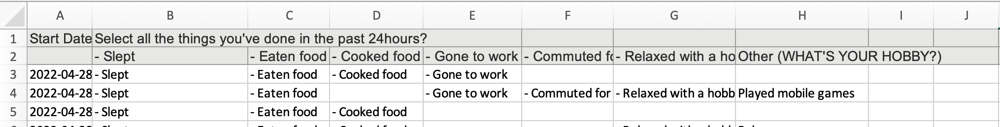

```{r setup, include=FALSE}
knitr::opts_chunk$set(echo = TRUE)
library(tidyverse)
library(janitor)
library(readxl)
library(tweetrmd)
```

There are lots of great survey tools available, but almost all of them have a completely data export format and they're often not that... great. This is particularly true when surveys contain multiple choice questions, the data comes in lots of different untidy formats.

This blogpost is going to demonstrate how we would use tidy data principles and the tidyverse to wrangle data from a variety of different survey tools. The data was initially gathered by me tweeting a link to the exact same survey in Google Forms, Qualtrics and Survey Monkey.

```{r}
tweet_embed("https://twitter.com/charliejhadley/status/1519696924328214528",
            align = "center")
```

The survey contained just one question that looks like this:


We'll be making use of the following packages in our wrangling

# Google Forms

Google Forms is the survey tool we usually choose as the forms look good and we can read the responses into R via the excellent [{googlesheets4}](https://googlesheets4.tidyverse.org/) package. To make things simpler, you can [download the results as an Excel file](https://github.com/rfortherestofus/rforus_tidying-survey-data/raw/main/data/google-forms-data.xlsx).

It's actually fairly pleasant to work with Google Forms survey data, as I demonstrate in this video. I've also provided a tidied up version of the code below.

VIDEO: https://muse.ai/v/mbbdvf3

```{r}
library(tidyverse)
library(readxl)
library(janitor)

google_forms_raw <- read_excel("data/google-forms-data.xlsx") %>% 
  clean_names()

fixed_responses <- c("Slept", "Eaten food", "Cooked food", "Gone to work", "Commuted for work", "Relaxed with a hobby (TELL US THE HOBBY BY TYPING IN THE OTHER FIELD)")

google_forms_tidy <- google_forms_raw %>% 
  separate_rows(select_all_the_things_youve_done_in_the_past_24hours,
                sep = ", ") %>% 
  mutate(things_done_in_last_24hours = case_when(
    select_all_the_things_youve_done_in_the_past_24hours %in% fixed_responses ~ select_all_the_things_youve_done_in_the_past_24hours,
    TRUE ~ "Other"
  ))

google_forms_tidy %>% 
  count(things_done_in_last_24hours) %>% 
  ggplot(aes(x = n,
             y = things_done_in_last_24hours)) +
  geom_col()

```


# Survey Monkey

Survey Monkey no longer has a free tier that allows you to download data from the service. There is an experimental package [{surveymonkey}](https://github.com/mattroumaya/surveymonkey) for directly downloading data from your account - but I haven't experimented with it.

The export format of Survey Monkey splits headers across multiple rows, which the {readxl} package on its own isn't designed to deal with. However, the awesome [{unheadr}](https://github.com/luisDVA/unheadr) package allows us to mash together column names across multiple rows.



As I show in the video, once we've used {unheadr} to tidy up the columns the next step is to convert the data from wide to long with pivot_longer().

```{r}
library(tidyverse)
library(readxl)
library(janitor)
library(unheadr)

survey_monkey_raw <- read_excel("data/survey-monkey-data.xlsx") %>% 
  mash_colnames(1) %>% 
  clean_names()

fixed_responses <- c("Slept", "Eaten food", "Cooked food", "Gone to work", "Commuted for work", "Relaxed with a hobby (TELL US THE HOBBY BY TYPING IN THE OTHER FIELD)")

survey_monkey_long <- survey_monkey_raw %>% 
  pivot_longer(select_all_the_things_youve_done_in_the_past_24hours_slept:last_col()) %>% 
  mutate(value = str_remove(value, "- "))

survey_monkey_tidy <- survey_monkey_long %>% 
  mutate(response_label = case_when(
    value %in% fixed_responses ~ value,
    is.na(value) ~ NA_character_,
    TRUE ~ "Other"
  )) %>% 
  select(start_date, response_label) %>% 
  drop_na(response_label)

survey_monkey_tidy %>% 
  count(response_label) %>% 
  ggplot(aes(x = n,
             y = response_label)) +
  geom_col()

```

# Qualtrics

Qualtrics does have a free tier allowing us to download data. There's also a great package called [{qualtRics}](https://docs.ropensci.org/qualtRics/) for programmatically downloading survey data from the platform.

I actually really appreciate the data format that Qualtrics uses, each question has two columns: one for the fixed responses and the other column contains write in values. As I demonstrate in the video below we can use separate_rows() to convert observations into a long, tidy dataset.

VIDEO: https://muse.ai/v/rWYr23B

```{r}
library(tidyverse)
library(readxl)
library(janitor)
library(unheadr)

qualtrics_data_raw <- read_excel("data/qualtrics-data.xlsx",
           skip = 1) %>% 
  clean_names()

qualtrics_tidy <- qualtrics_data_raw %>% 
  separate_rows(select_all_the_things_youve_done_in_the_past_24hours_selected_choice,
                sep = ",")

qualtrics_tidy %>% 
  count(select_all_the_things_youve_done_in_the_past_24hours_selected_choice) %>% 
  ggplot(aes(x = n,
             y = select_all_the_things_youve_done_in_the_past_24hours_selected_choice)) +
  geom_col()
```


